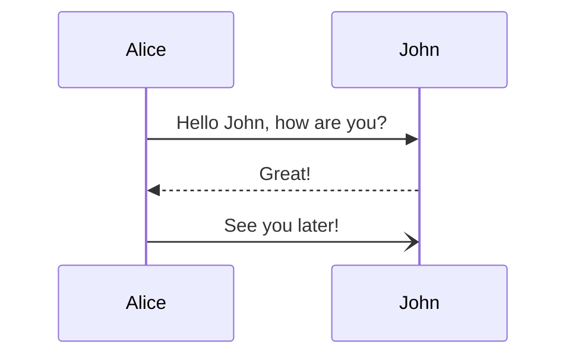

Pic Section

- 😄 This is First Section


---

Code Section
- 😄 This is Code Section
```python
print("hello world!")

```

```rust
fn main() {
    println!("This is Rust")
}
```
---
This is chat section
| Month    | Savings |
| -------- | ------- |
| January  | $250    |
| February | $80     |
| March    | $420    |




---

More Section
- ❤️ This is More Section

---

